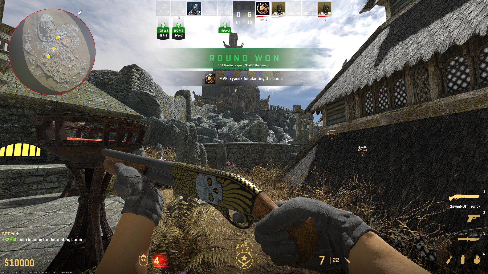
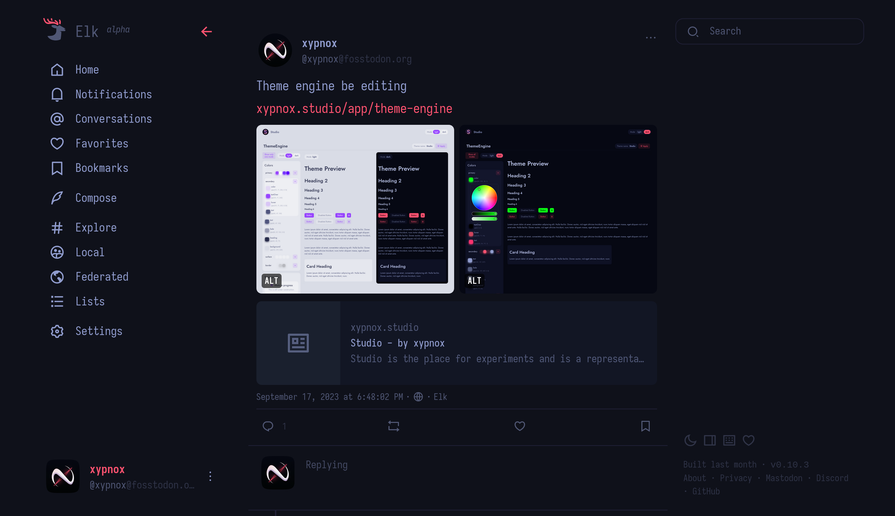
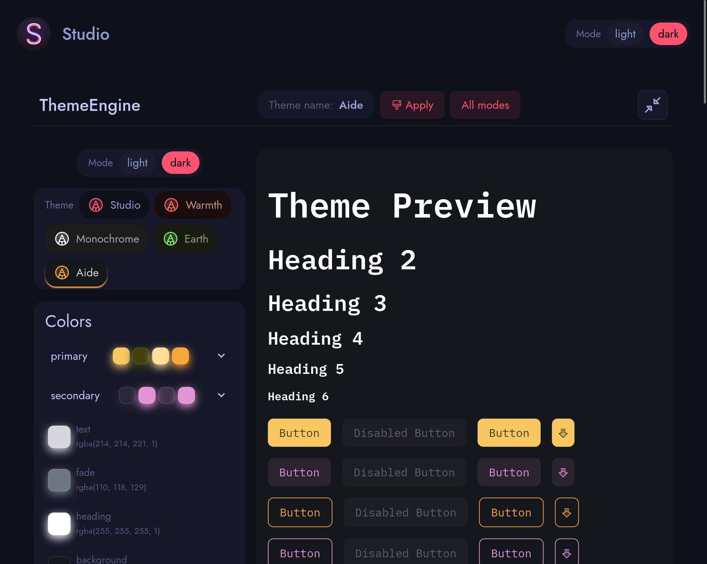
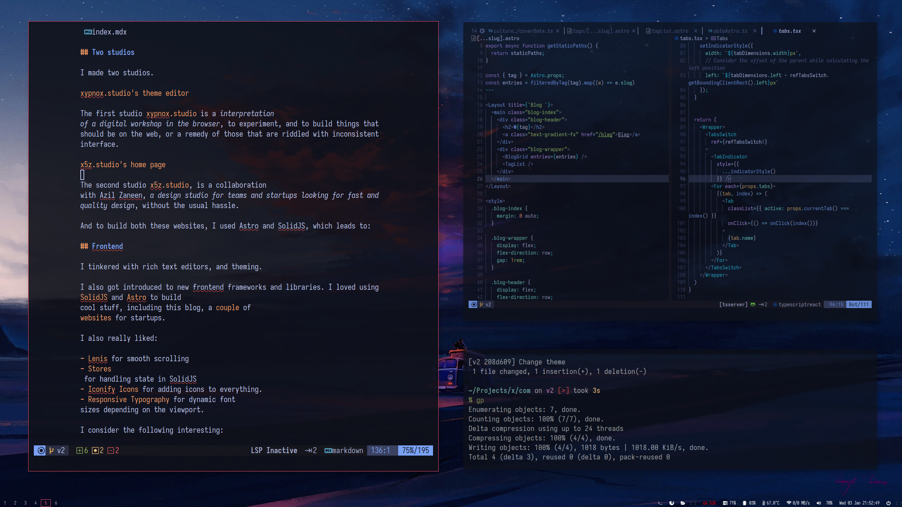

import { ImageGrid } from '../../../components/imageGrid';
import { coverData } from './coverData';

Let me take this time. The time between what I will say later and when you started reading this, to delight that this text would take the place that lay empty for so long. And while I planned a different post to break this ice that has been frozen for about 3 years now, I don't think that post will make it in time. I am still learning about the topic I was writing about, while building the tools to write it with.

So for the meanwhile, let me revive the annual tradition that I _ended the year that I started it_. Of [tech](/blag/posts/tech-2020) and [culture](/blag/posts/culture-2020) recaps. But now I have to recap 3 years instead of 1 (but it serves me right). Both discussions on [Culture](#culture) and [Technology](#technology) have been combined in this single post. And the post has been hurried, for it needs no new ideas, or ways to show those ideas. And since it has been hurried, please be a little more lenient with the grammar. (I refuse to use any aid/helper tools apart from spellcheck)

# Culture

Firstly, I won't mention everything, the more curious can always scour my accounts [on Goodreads](https://goodreads.com/xypnox) for the books I read and [on Spotify](https://open.spotify.com/user/vm9mg8nzn3nqb3wyxcn8gyaac) for the songs I listen to.

And my tastes have not changed much. I still enjoy reading _fantasy, fiction, and classics_. And I still listen to a _broad variety of genres_, although I do have to admit I don't listen to songs as much as I used to.

## Books

- [Sandman - Neil Gaiman](https://en.wikipedia.org/wiki/The_Sandman_(comic_book))
  When we first start reading the Sandman, we enter the Sandman's world. And once we reach the end, The Sandman enters our world.
  > “Writers are liars, my dear, surely you know that by now? And yet, things need not have happened to be true. Tales and dreams are the shadow-truths that will endure when mere facts are dust and ashes, and forgot.”
- [The Handmaid's Tale - Margaret Atwood](https://en.wikipedia.org/wiki/The_Handmaid%27s_Tale)
  A tale from a world where the purpose of men and women have been set in stone. And we see the way the society gets structured and how rules bend towards those that make them.
  > The things I believe can't all be true, though one of them must be. But I believe in all of them, all three versions of Luke, at one and the same time. This contradictory way of believing seems to me, right now, the only way I can believe anything. Whatever the truth is, I will be ready for it. This also is a belief of mine. This also may be untrue.
- [The Name of the Wind - Patrick Rothfuss](https://en.wikipedia.org/wiki/The_Name_of_the_Wind)
  The first book of the trilogy was released on 2007, the second book, The wise man's fear was released in 2011. And it has been 13 years since. And no closure to this magnificent epic.
  > Ben leaned forward on his stump. “What if a dozen people told you, with perfect earnestness, that shamble-men were out in the fields, eating—”
  >
  > “Of course I wouldn’t believe them,” my father said, irritated. “It’s ridiculous.”
  >
  > “Of course it is,” Ben agreed, raising a finger. “But the real question is this: Would you go into the woods?”
- [The Midnight Library - Matt Haig](https://en.wikipedia.org/wiki/The_Midnight_Library)
  A fantasy about the library after the clock hits midnight, and the opportunities, wishes and desires are made true.
  > ‘The rook is my favourite piece,’ she said. ‘It’s the one that you think you don’t have to watch out for. It is straightforward. You keep your eye on the queen, and the knights, and the bishop, because they are the sneaky ones. But it’s the rook that often gets you. The straightforward is never quite what it seems.’
- [Where the Crawdads Sing - Delia Owens](https://en.wikipedia.org/wiki/Where_the_Crawdads_Sing)
  A tale of the childhood, needs, desertion, and human behavior with a few bits of nature/poems in between.
  > When cornered, desperate, or isolated, man reverts to those instincts that aim straight at survival. Quick and just. They will always be the trump cards because they are passed on more frequently from one generation to the next than the gentler genes. It is not a morality, but simple math. Among themselves, doves fight as often as hawks.
- [East of Eden - John Steinback](https://en.wikipedia.org/wiki/East_of_Eden_(novel))
  John Steinback's magnum opus, also recommended are [Of Mice and Men](https://en.wikipedia.org/wiki/Of_Mice_and_Men) and [The Grapes of Wrath](https://en.wikipedia.org/wiki/The_Grapes_of_Wrath)
  > We have only one story. All novels, all poetry, are built on the never-ending contest in ourselves of good and evil. And it occurs to me that evil must constantly respawn, while good, while virtue, is immortal. Vice has always a new fresh young face, while virtue is venerable as nothing else in the world is.
- [Everytime I find the meaning of life they change it - Daniel Kelin](https://www.goodreads.com/book/show/24612009-every-time-i-find-the-meaning-of-life-they-change-it)
  A quandry surely, one must have encountered. Once the meaning of life has been determined, it appears that it was meaningless and a quest of meaning begins anew. What then is the end of this cycle?
  > Other questions needed to be answered first, such as, “How can we know what is true?” and, “Is there a rational basis for ethical principles?” and, “What is the meaning of ‘meaning’?” After all, it made no sense to wonder about the meaning of life, mine or anybody else’s, if I didn’t know what “meaning” meant.

- [The First Law trilogies - Joe Abercrombie](https://en.wikipedia.org/wiki/The_First_Law)
  A net of characters that are not the usual good/evil, with several perspectives of the flawed lives, finding a way by in the ruthless world. And yes there are two trilogies, and both are wonderful. There are also additional stories if that's still not enough.
  > ‘So tell me. These good people. If they get a little more, what will they want then?’ Vick paused a moment, but there was nothing else to say. ‘A little more.’ ‘Because that is the nature of people. And their little more must be taken from someone else, and that someone else will be less than delighted. One cannot eliminate unhappiness any more than one can eliminate darkness. The goal of government, you see,’ and the Arch Lector prodded at the air with his bony forefinger, ‘is to load the unhappiness onto those least able to make you suffer for it.’

## Music

It seems that regularly making fortnightly playlists helps mark when I first started to hear a song, and in these three years I have listened to a plenty of new sounds, and some noise as well. However effective the system may be, there are bound to be too many songs to filter through.

I didn't attempt at a compilation of 2021, and so instead, here are my top songs of 2021 (as compiled by Spotify), which has some decent bangers:

<iframe style="border-radius:12px" src="https://open.spotify.com/embed/playlist/6PXpCQp5lotSE1fxwn1Ygt?utm_source=generator" width="100%" height="152" frameBorder="0" allowfullscreen="" allow="autoplay; clipboard-write; encrypted-media; fullscreen; picture-in-picture" loading="lazy"></iframe>

I made one half baked compilation of 2022, which I gave up on filtering and adding more. Unfortunately the more songs I listened to, the more there was to review, so much so that the review playlist I made to filter out the non obvious songs I had liked that year turned out to be 16 hours long. I listened to some of it on random but gave up and the rest is unfiltered still:

<iframe style="border-radius:12px" src="https://open.spotify.com/embed/playlist/2GlLs8LzCW9Izhh5SNPTbI?utm_source=generator&theme=0" width="100%" height="152" frameBorder="0" allowfullscreen="" allow="autoplay; clipboard-write; encrypted-media; fullscreen; picture-in-picture" loading="lazy"></iframe>

And the one I made (am making) of 2023:

<iframe style="border-radius:12px" src="https://open.spotify.com/embed/playlist/5jjpCKgkwirazezrugzL0q?utm_source=generator" width="100%" height="600" frameBorder="0" allowfullscreen="" allow="autoplay; clipboard-write; encrypted-media; fullscreen; picture-in-picture" loading="lazy"></iframe>

## Covers

And naturally the covers of three years of Spotify playlists had accumulated, and I made a [covers page](/design/covers) earlier, where all of the covers can be browsed. 

Here are my favorites: 

  <ImageGrid client:load images={coverData} />

## Games

As it sometimes happens with hobbies in large fields, out of the dozen games that I acquired, I only really played [Counter Strike](https://en.wikipedia.org/wiki/Counter-Strike). And I could write a post on why CS is so unique and engaging and what I like about it, maybe I will, in the meantime, those who might want to play can request so on [my account](https://steamcommunity.com/id/xypnox/). I like the game, the mechanics, the strategies and the delicate balance between the teams. The repeated nature of rounds where variations are key.

I played [Forza Horizon 5](https://en.wikipedia.org/wiki/Forza_Horizon_5) for a while on console and got pretty good at it. I could drive well with manual gear changes. It had nice graphics and good cars. It also had freeroam, where all of the map was free to drive, which was chill af.

I also enjoyed [Strike Force Heroes](https://sfhgame.com/) for a while. A revival of the old flash games on the web that I played when in school, devoid of a graphic card. Although this iteration is far more decent in terms of graphics and the gameplay and progression are well done. But after some time, the grind became real, nostalgia wore off, and the multiplayer was never fun.

## Movies/Shows

We are left with a thought, an idea, a situation we try to resolve long after we finished watching these motion films.

The ones that pop out to me:

- [Everything everywhere all at once](https://en.wikipedia.org/wiki/Everything_Everywhere_All_at_Once)
  An explosion of possibilities while exploring the relations between a family and the pressure of a parent on a child.
- [Rick and Morty](https://en.wikipedia.org/wiki/Rick_and_Morty)
  Fascinating how they have still remained fresh and just when you think you can guess what happens next, Morty dies.
- [South Park](https://www.southparkstudios.com/)
  It manages to stay relevant and weird, with new perspectives and scenarios. For example consider [the episode on ChatGPT](https://www.southparkstudios.com/episodes/8byci4/south-park-deep-learning-season-26-ep-4).
- [The Boondocks](https://en.wikipedia.org/wiki/The_Boondocks_(2005_TV_series))
  An old cartoon series that highlighted several social issues and explained a lot of the hip hop culture.
- [Mad Men](https://en.wikipedia.org/wiki/Mad_Men)
  A series about the advertisement agencies of the yore, where nostalgia was sold as a box with a light.
- [The Grand Tour](https://en.wikipedia.org/wiki/The_Grand_Tour)
  The three old farts never loose their charm through their hilarious and creative adventures. They jostle each other to make the other look the stupidest, and while the pranks are predictable, the experience is authentic.

# Technology

It would be a little overwhelming to note down everything I learned or created in the past 3 years. I will cover a few overarching topics and dive deeper in later posts.

## Social Media & Mastodon

In 2020 there used to be _a relatively normal social network where folks of tech could be found discussing, debating, learning and developing with each other_, and I enjoyed using that website. However, it is 2023, and that place is no more, but there is another that has taken its place. It is [Mastodon](https://joinmastodon.org/). And what was true for the village of 2020 is true for Mastodon now.

Thus, I shifted to Mastodon as my primary social network, as in the one where the most "digital" time was spent. Those familiar with me and who used to follow me on the old network would have noticed/ignored my absence there since. And a mute blog with no updates doesn't help clarify that _all new info I was sharing was shared on my [Fosstodon account](https://elk.zone/fosstodon.org/@xypnox)_. Also, I use [Elk](https://elk.zone/) for browser and the default Android app on mobile.

## Two studios

I made two studios.

The first studio [xypnox.studio](https://xypnox.studio/) is a _interpretation of a digital workshop in the browser_, to experiment, and to build things that should be on the web, or a remedy of those that are riddled with inconsistent interface.

The second studio [x5z.studio](https://www.x5z.studio/), is a collaboration with Azil Zaneen, _a design studio for teams and startups looking for fast and quality design_, without the usual hassle. 

And to build both these websites, I used Astro and SolidJS, which leads to:

## Frontend

I tinkered with rich text editors, and theming.

I also got introduced to new frontend frameworks and libraries. I loved using [SolidJS](https://www.solidjs.com/) and [Astro](https://astro.build/) to build cool stuff, including this blog, a [couple](https://calry.app) of [websites](https://nirah.app) for startups.

I also really liked:

- [Lenis](https://lenis.studiofreight.com/) for smooth scrolling
- [Stores](https://docs.solidjs.com/references/api-reference/stores/using-stores) for handling state in SolidJS
- [Iconify Icons](https://iconify.design/) for adding icons to everything.
- [Responsive Typography](https://www.fluid-type-scale.com/) for dynamic font sizes depending on the viewport.

I consider the following interesting:

- [Phind](https://www.phind.com/) for searching about bugs/issues/tech related queries.
- [Bing Image Creator](https://www.bing.com/images/create) to generate free images via Dall-E.

## PC

I built a new PC at the start of 2023, and it has lasted the year well. Here are the specs:

_CPU_: Intel i7-13700K (24) @ 5.3GHz
_GPU_: Nvidia RTX 3060 Ti 
_Memory_: 32GB DDR5
_Displays_: Twin 27" 2560x1440 (165Hz and 75Hz)

_Mouse_: [Logitech G502X White (wired)](https://www.logitechg.com/en-us/products/gaming-mice/g502-x-wired-lightforce.910-006144.html)
_Keyboard_: [Keydous NJ80 White with Ocean Wave Keycaps](https://drop.com/buy/keydous-nj80-bluetooth-rgb-keyboard-drop-exclusive)

_OS_: [EndeavourOS](https://endeavouros.com) Linux x86_64
_Shell_: zsh 5.9
_WM_: i3
_Editor_: LunarVim (Neovim 0.9.4)

Configuration files can be found in the [dotfiles repo](https://github.com/xypnox/dotfiles).

I dualboot on this machine, with Windows 11 designated as the Gaming OS and the rest of everything handled by EndeavourOS.

After using a ton of Mac devices, returning back to [i3 window manager](https://i3wm.org/) was a bliss. The splits and shortcuts and the ease were all what they used to be, fast efficient and out of the way. Indeed it took time to get it to set up properly, and there are things I still want to change, but the current setup works nicely, and fits like a glove.

My notes have also evolved a lot since I [last attempted](/blag/posts/notes/intro) to explain the system I use for note-taking. I _will_ write the updated version soon, as a lot of what was blurry has now since cleared up. And habits have gotten time to be tested.

---

So that was the Recap.

I hope the next year's would be shorter/easier to write. And that the Astro's Github action [won't break just when I am ready to publish the post](https://github.com/withastro/action/issues/37) .

As for what is brewing next? It is in the darkness that the answers lie.

