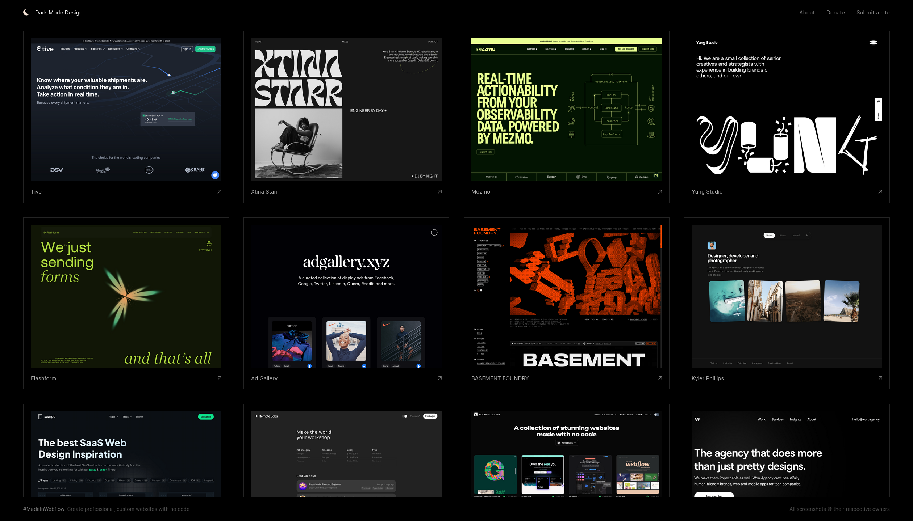
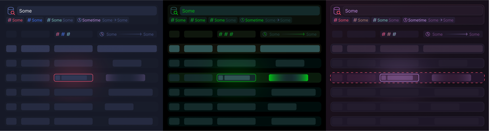

import { ThemePreview, ThemePreviewSplits, themePreviewConfigVars, themePreviewElementConfigs, themePreviewSplitsConfigs }  from '../../../components/themePreview'

{/* The difficulties faced in making a dark mode. */}

{/* I have a multitude of thoughts about theming, styling, modes etc, this post is about the difficulties usually encountered in implementing a dark mode. */}

Dark mode has now become a staple in modern interfaces. Mainstream apps, government websites, and operating systems all have dark modes now, and I prefer them over the harsh white, however ugly they may be.

Dark mode is _a different stylistic version of the same interface_, and uses lighter colors on top of darker background. We expect _no change_ in layout. Any changes that could be done to the layout should work in both modes.

But should _everything_ need a dark mode?
And can _everything_ be turned dark?

# Is it needed?

Dark mode is cool'n'all but does it make sense in your situation? The question we must understand is _whether mode switching is necessary or not_. Whether a single mode, light or dark, makes more sense than adding the option to switch modes.

{/* The point of having modes and the ability to switch between them is directly dependent on the content that is being presented. Not everything needs to be switchable, between light and the dark.*/}

Whether one should have a dark mode depends on what one wants to show, i.e. it depends on the _content_ being shown. And to whom it is being shown to, and for what purpose. (The _context_) And we should consider both while deciding whether dark mode(s) is needed.

{/* Power savings aside, */}
I consider _frequently used applications and apps that focus on the content_ ideal for dark modes. Applications are opened more frequently and people spend more time with their interface than normal websites. _Complex editors_ - both text and graphic - want to focus on the thing being edited rather than the editor's interface itself; and dark mode succeeds in fading the interface away.

There is always a tug of war between usability and uniqueness. _The more the interface looks and behaves like every other interface, the more usable it will be, but the less unique._ A usable interface shall remain usable in dark mode as long as the contrast and legibility are cared for.



Sometimes dark mode can become a brand identity. 

Additionally, dark mode allows for the possibility of high contrast modes. 

There are arguments from research about how the black on white background (light mode) is easier on the eyes for reading, but in my case, I have developed a fondness with dark mode after several years of usage. And hence I like to interact with interfaces in dark mode.

---

# The conversion

After considering the content and the context, if dark mode is indeed what we want, we can begin our journey in converting our interface to a dark mode.

Initially we can be tempted to use one of the most common methods of converting a light mode to a dark mode. Simply _switching the background and text colors_. Here is a rudimentary example:

<ThemePreviewSplits
  client:visible
  {...themePreviewSplitsConfigs.bnw}
  previews={[
  {
    vars: { txt: "#000", bg: "#fff", },
    elements: [
      {
        type: "h1",
        text: "Black & White",
      },
      {
        type: "text",
        text: "Black letters look thin as white light bleeds into the black lines, also things appear light and airy"
      },
    ]
  },

  {
    vars: { txt: "#fff", bg: "#000", },
    elements: [
      {
        type: "h1",
        text: "Black & White",
      },
      {
        type: "text",
        text: "White letters bleed light onto the black background making text appear thicker. Consider also that this black is currently inside a dark blog.",

      },
    ]
  }

  ]}
/>

While this suffices for basic text, there is a large variety of elements and layouts that will not look good with this simple flip. For example, if we have one color for text and another for headings in light mode, what color should the background be in dark mode? We have to consider how colors change in dark mode, and what we want our surfaces to look like.

## Colors

Although an explanation about how the _perceived colors depend on the background_ is not needed, here is a fine example:

<ThemePreviewSplits
  client:visible
  previews={[
    {
      vars: {
        txt: '#333',
        surface: '#fff',
        primary: {
          color: '#447DEB',
          over: '#fff'
        },
        bg: '#EBEDF2',
      },
      elements: [
        { type: 'text', text: 'Notice the color blue' },
        { type: 'button', text: 'Bluuue' },
        { type: 'card', text: 'This is our benchmark' },
      ]
    },
    {
      vars: {
        txt: '#eee',
        surface: '#303748',
        primary: {
          color: '#447DEB',
          over: '#fff'
        },
        bg: '#1A1E27',
      },
      elements: [
        { type: 'text', text: 'Now a direct conversion' },
        { type: 'button', text: 'Bluuue' },
        { type: 'card', text: 'See how this doesn\'t match' },
        { type: 'text', text: 'Even though its the exact same hex code!' },
      ]
    },
    {
      vars: {
        txt: '#eee',
        surface: '#303748',
        primary: {
          color: '#2A5EC3',
          over: '#fff'
        },
        bg: '#1A1E27',
      },
      elements: [
        { type: 'text', text: 'A little adjustment' },
        { type: 'button', text: 'Bluuue' },
        { type: 'card', text: 'To the color makes it match the color in light mode.' },
      ]
    },
  ]}
  showInfo={false}
/>

Colors in the light background look different when shown with dark background. Notice how the contrast and saturation change when we flip the default colors of Bootstrap:

<ThemePreviewSplits
  client:visible
  {...themePreviewSplitsConfigs.bnw}
  previews={[
    {
      vars: themePreviewConfigVars.lightColorsVars,
      elements: [{type: 'colors', text: ''}]
    },
    {
      vars: themePreviewConfigVars.darkColorsVars,
      elements: [{type: 'colors', text: ''}]
    },
  ]}
/>

Sometimes retaining these slight mismatches may be what is desired, but we can tweak the colors to suit each other and the background.

Tweaked themes work well together and still retain contrast to differentiate with color. Color should not be the sole way of differentiation as it would not be legible to the visually impaired. Moreover, anything that makes things more legible is good for everyone.

A few examples of color palettes that work well together:

<ThemePreviewSplits
  client:visible
  {...themePreviewSplitsConfigs.bnw}
  previews={[
    {
      vars: themePreviewConfigVars.xypColorsVars,
      elements: [{type: 'colors', text: ''}]
    },
    {
      vars: themePreviewConfigVars.gruvColorsVars,
      elements: [{type: 'colors', text: ''}]
    },
  ]}
/>

The first set of colors above are the ones currently being used on this website, and the second are chosen from the [Gruvbox color scheme](https://github.com/lifepillar/vim-gruvbox8). Similar harmony of colors is also used in choosing the [color palette in Material Design 3](https://m3.material.io/styles/color/advanced/adjust-existing-colors#1cc12e43-237b-45b9-8fe0-9a3549c1f61e).

### The ugly gray

One of the easiest ways to make a dark mode color palette is to pick shades of gray. However, the interfaces that use such gray shades look dull and washed out. Desaturated. As if someone disabled the app itself instead of a button. Especially if [combined with material design (v2)](https://m2.material.io/design/color/dark-theme.html#properties).

<ThemePreviewSplits
  client:visible
  previews={[
    {
      vars: {
        txt: '#eee',
        surface: '#333',
        bg: '#222',
      },
      elements: [
        { type: 'h2', text: 'Gray is static, gray is ugly' },
        { type: 'card', text: 'Gray on gray is uglier still' },
        { type: 'text', text: 'Gray is grey, gray and darkgray and lightgray and dark all at the same time.' },
      ]
    },
    {
      vars: {
        txt: '#eee',
        surface: '#333',
        bg: '#111',
      },
      elements: [
        { type: 'h1', text: 'A little darker?' },
        { type: 'text', text: 'We might as well have used black' },
        { type: 'card', text: 'And the surfaces still look ugly' }
      ]
    },
    {
      vars: {
        txt: "#B5C0DB",
        bg: "#1A1E27",
        surface: "#303748",
      },
      elements: [
        { type: 'h1', text: 'Adding a bit of color' },
        { type: 'card', text: 'Adds a lot of life that was missing' },
        { type: 'text', text: 'In these drab slabs of gray' }
      ]
    },
    {
      vars: {
        txt: "#B5C0DB",
        bg: "#0f111a",
        surface: "#1A1E27",
      },
      elements: [
        { type: 'h1', text: 'And we can always go darker still' },
        { type: 'text', text: 'Though the effect is not as pronounced as saturation is low' },
        { type: 'card', text: 'Yet it is good enough' }
      ]
    },
  ]}
  showInfo={false}
/>

And I think these gray themes are what have given the dark mode the aura of unsaturated monochromatic soulless interfaces. As if colors are meant to be reserved for the light mode. Adding a hint of color makes them look more vibrant and saturated.

### Colors that were lost

Some colors look bad on white background if used as text. Yellow is a prime example. But in the world of dark mode, yellow literally shines!

<ThemePreviewSplits
  client:visible
  previews={[
    {
      vars: {
        txt: 'yellow',
        bg: '#fff',
      },
      elements: [
        { type: 'text', text: 'Yellow in dark mode is more readable' },
        { type: 'text', text: 'than the light mode' },
      ]
    },
    {
      vars: {
        txt: "yellow",
        bg: "#0f111a",
      },
      elements: [
        { type: 'text', text: 'Yellow in dark mode is more readable' },
        { type: 'text', text: 'than the light mode' },
      ]
    },
  ]}
  showInfo={false}
/>

Another example are the headings here in the blog, the color would just not work with light mode.

## Surfaces

Another dilemma arises when we have a background and a card, there are several _ways to differentiate the background with the foreground_.

In the light mode, we can enjoy a variety of styles to separate content into boxes.

<ThemePreviewSplits
  client:visible
  previews={[
      {
        vars: themePreviewConfigVars.lightModeShadowCardVars,
        elements: [
          { type: 'card', text: 'A shadow on a box is universally exploited as a card. It adds the perception of depth.' },
      ],},
      { vars: themePreviewConfigVars.lightModeCardVars,
        elements: [
          { type: 'card', text: 'A lighter background can look as if it is ahead of a darker background even though there are no shadows.' },
      ],},
      { vars: themePreviewConfigVars.lightModeCardFlippedVars,
        elements: [
          { type: 'card', text: 'A darker background can mean anything, from simple info to notifications, buttons and disabled elements as well.' },
      ],},
      { vars: themePreviewConfigVars.lightModeCardBorderVars,
        elements: [
          { type: 'card', text: 'A border can be a box if the design system decides it is so, and it can also be used as input.' },
      ],},
  ]}
/>


### Shadows

Natural looking shadows are easy in light mode as there is ample contrast from the lighter background for a faint shadow to be visible, however in dark mode, the shadow opacity and darkness has to be turned all the way up. Sometimes a glow is added instead as it matches the dark metaphor.


<ThemePreviewSplits
  client:visible
  previews={[
      {
        vars: themePreviewConfigVars.lightModeShadowCardVars,
        elements: [
          { type: 'card', text: 'This shadow looks fine, like a normal card would make.' },
      ],},
      {
        vars: themePreviewConfigVars.darkModeShadowCardVars,
        elements: [
          { type: 'card', text: 'Notice how the same shadow is barely visible in dark mode' },
      ],},
      {
        vars: themePreviewConfigVars.darkModeSharpShadowCardVars,
        elements: [
          { type: 'card', text: 'But once we pump up the shadow opacity we get similar contrast.' },
      ],},
      {
        vars: themePreviewConfigVars.darkModeGlowCardVars,
        elements: [
          { type: 'card', text: 'A bit of glow, but it can sometimes become too harsh.' },
      ],},
  ]}
/>


As we cannot rely on shadows, having a contrast difference between the background and the foreground can serve to differentiate content. However, should the foreground be lighter or darker?


<ThemePreviewSplits
  client:visible
  {...themePreviewSplitsConfigs.card}
/>


Lighter surfaces simulate as if a light source is above the screen lighting it from atop, and the surfaces further forward are shaded lighter. For multiple stacked surfaces we can make the surfaces above lighter than the ones below. Do not add additional surfaces only for dark mode. 


### Shiny

A shiny look can be implemented by replicating the characteristics of the light reflections via a gradient border and background. An example of the current shiny look: 

<ThemePreview
  client:visible
  preview={{
        vars: themePreviewConfigVars.shinyCardVars,
        elements: [
          { type: 'shinycard', text: '',
            elements: [
              { type: 'h1', text: 'AI Beast' },
              { type: 'text', text: 'The beast machine that can determine the fate of AI in the future of large language models and cloud compute.' },
              { type: 'button', text: 'Hallucinate' },

            ]
          },
      ],}
  }
/>

## The code block

While styling basic components is straightforward, there are elements that have a large number of colors, take the code block for example:

```js
// Just some jsx to preview the theme!
/**
 * Shows a single theme prevw
 * Requires theme vars: `Themevars`
 */
export const ThemePreview = (props: ThemePreviewProps) => {
  const themeCssVars = flattenObject(props.preview.vars ?? lightMode, (keys, value) => [
    `--preview-${keys.join("-")}`,
    value,
  ]);

  return (
    <Container>
      <Column style={{ ...themeCssVars }}>
        <For each={props.preview.elements ?? themePreviewElementConfigs.minimal.preview.elements}>
          {(element) => (
            <RenderElement element={element} />
          )}
        </For>
      </Column>
      <Show when={props.showInfo === undefined || props.showInfo}>
        <ThemeInfo {...props} />
      </Show>
      {props.children}
    </Container>
  )
}
```

In the days before mode switching, code blocks had a dark color scheme in light modes. Should light mode and dark mode both have different color schemes? Does this mean we add a light code highlighting theme for dark mode? Nope.

Chances are you are using a popular color scheme, thus it would be available/convertable to the code highlighting solution you use. If not so, picking from one of the default color schemes also works. Go for a specific customized version if it is important, and make sure that the color scheme remains consistent across the experience.


Consider one of the classic dark mode themes: [Tomorrow Night](https://github.com/chriskempson/tomorrow-theme). 

<ThemePreview
  client:visible
  preview={{
    vars: themePreviewConfigVars.codeVars,
    elements: [
      { type: 'code', text: ''},
    ]}}
/>

Some may want a custom theme that matches their overall style, so they may want to create a new theme or tweak an existing one. However it is not an easy affair, we have to create a custom theme for the highlighter that is being used. For which we usually find a theme we derive from.

As an example, this blog uses astro which comes with [shikijs/shiki](https://github.com/shikijs/shiki) syntax highlighter which can take a textmate or vscode highlighting config and use it to highlight code in html. However, due to the inherent complexities of the structure of theme, modification is non trivial. While I was tempted by it's css-variables color theme, it doesn't work as nicely with complex code snippets such as `jsx`. I ended up writing/tweaking the default vscode dark theme to match my color scheme.

Perhaps our optics desire a more lively look and we like lavender and pink as our main colors. A few variations of such custom theme could be:

<ThemePreviewSplits
  client:visible
  previews={[
    {
      vars: themePreviewConfigVars.themeCodeVars,
      elements: [
        { type: 'code', text: ''},
    ],},
    {
      vars: themePreviewConfigVars.lightThemeCodeVars,
      elements: [
        { type: 'code', text: ''},
    ],},
  ]}
/>

## Icons & Illustrations

Icons and Illustrations add visual appeal to an interface and help users navigate & understand by adding meaning via graphics.

Simple icons and illustrations can be directly converted to dark mode by inverting the colors and tweaking them to suit the needs. For icons, a icon-font or svg icons (ex: iconify.design) can be adjusted via the text color. Illustrations in vector formats also lend themselves to tweaking the colors for the dark mode.

<ThemePreviewSplits
  client:visible
  previews={themePreviewSplitsConfigs.icons.previews}
/>

But it should be noted that not all illustrations and icons are fit for direct conversion.

In case of icons, we can take the phases of the moons for example. A standard icon for the new moon is one of a dark moon with no light. However, it doesn't translate to dark mode as the meaning of the colors to represent the phases is also inverted. In such a case, using a different set of icons corresponding for different modes works well. The second variant is a simple flip of colors, the third variant has the icons shifted by half the length so that the icons match with their intended meaning with light mode.

<ThemePreviewSplits
  client:visible
  previews={themePreviewSplitsConfigs.moonIcons.previews}
/>

For illustrations, we should be mindful of the backgrounds, and the contrast between the elements and the background. For example consider these illustrations from [undraw.co](https://undraw.co/illustrations):

<ThemePreviewSplits
  client:visible
  previews={[
    {
      elements: [ { type: 'illus', text: '/dark-modes/undraw1.svg' } ],
      vars: { bg: '#fff', txt: '#000'}
    },
    {
      elements: [ { type: 'illus', text: '/dark-modes/undraw1.svg' } ],
      vars: { bg: '#000', txt: '#fff'}
    },
    {
      elements: [ { type: 'illus', text: '/dark-modes/undraw1.1.svg' } ],
      vars: { bg: '#000', txt: '#fff'}
    },
  ]}
/>

Here the first variant is the illustration in light mode. Notice how changing the background to black makes the shape stand out when it is not necessary. We can adjust the shade of the shape to match the dark mode, and make the steps lighter for better contrast.

<ThemePreviewSplits
  client:visible
  previews={[
    {
      elements: [ { type: 'illus', text: '/dark-modes/undraw2.svg' } ],
      vars: { bg: '#fff', txt: '#000'}
    },
    {
      elements: [ { type: 'illus', text: '/dark-modes/undraw2.svg' } ],
      vars: { bg: '#000', txt: '#fff'}
    },
    {
      elements: [ { type: 'illus', text: '/dark-modes/undraw2.1.svg' } ],
      vars: { bg: '#000', txt: '#fff'}
    },
  ]}
/>

Here the conversion results in poor contrast of the legs and the desktop with the background and the less desirable high contrast of the table. Tweaking these colors helps us make the illustration somewhat legible again. Also don't forget turning the interfaces inside the illustrations to dark mode as well!

## Contrasty design

There are designs (of websites, products) that use different modes (dark/light) in the same interface to distinguish a sidebar/navigation/sections of a page.

For example consider the alternating sections of a website:

<ThemePreviewSplits
  client:visible
  previews={[
  {
    vars: {
      txt: '#172d60',
      bg: "#B5C0DB",
      surface: '#333',
      colors: {
        "section-1": "#333851",
        "section-1-txt": "#f0f0f0",
        "section-0": "#f0f0f0",
        "section-0-txt": "#222",
        "section-2": "#f0f0f0",
        "section-2-txt": "#222",
      }
    },
    elements: [
      { type: 'sections', text: '',
        elements: [
          { type: 'section', elements: [
            { type: 'h2', text: 'These split sections' },
            { type: 'text', text: 'have a lot of clear separation' },
          ]},
          { type: 'section', elements: [
            { type: 'h1', text: 'The separators' },
            { type: 'text', text: 'Are particularly legible' },
          ]},
          { type: 'section', elements: [
            { type: 'h2', text: 'Nice it is that' },
            { type: 'text', text: 'And the content is marked' },
          ]},
        ]
      },
    ]
  },
  {
    vars: {
      txt: '#172d60',
      bg: '#1A1E27',
      surface: '#303748',
      colors: {
        "section-0": "#333851",
        "section-0-txt": "#f0f0f0",
        "section-1": "#f0f0f0",
        "section-1-txt": "#222",
        "section-2": "#333851",
        "section-2-txt": "#f0f0f0",
      }
    },
    elements: [
      { type: 'sections', text: '',
        elements: [
          { type: 'section', elements: [
            { type: 'h2', text: 'These split sections' },
            { type: 'text', text: 'Will look generally the same' },
          ]},
          { type: 'section', elements: [
            { type: 'h1', text: 'In Dark mode' },
            { type: 'text', text: 'As the reasons for night usage and content focus have been abandoned.' },
          ]},
          { type: 'section', elements: [
            { type: 'text', text: 'But at least it is unique' },
          ]},
        ]
      },
    ]
  },
  ]}
  showInfo={false}
/>

These split sections are a stylistic choice and would look somewhat similar in both modes. The decision whether to flip them individually or let them remain in their original modes is entirely subjective.

Sidebars are another example of using two modes in the same interface. Generally the sidebar is dark and the main content is light mode.

<ThemePreview
  client:visible
  preview={{
    vars: {
      txt: "#1A1E27",
      bg: "#B5C0DB",
      surface: "#dae2f6",
      colors: {
        "section-1": "#dae2f6",
        "section-1-txt": "#1A1E27",
        "section-0": "#f0f0f0",
        "section-0-txt": "#222",
        "sidebar-bg": "#1A1E27",
        "sidebar-txt": "#B5C0DB",
        "border": "#8B97B2",
      }
    },

    elements: [
      { type: 'sidebar', text: '',
        elements: [
          { type: 'sections', text: '',
            elements: [
              { type: 'section', elements: [
                { type: 'h1', text: 'The Main Section' },
                { type: 'text', text: 'contains the content on the page, this is usually the dashboard of the application' },
              ]},
              { type: 'section', elements: [
                { type: 'h2', text: 'It\'s light color' },
                { type: 'text', text: 'Serves as ample contrast for the sidebar in dark background beside it.' },
              ]},
            ]
          },
          { type: 'card', text: 'However one should also consider that both just light and just dark sidebars are possible' },
      ]},
    ]
  }}
/>


While this is effective to some degree. It is neither dark nor light. And the contrast is needless in most cases.

> And heaven forbid if one considers changing the color of the sidebar equates to dark mode.

One can have similar interfaces in all dark mode:


<ThemePreview
  client:visible
  preview={{
    vars: {
      colors: {
        "section-0": "#3C3836",
        "section-0-txt": "#AEA398",
        "section-1": "#302B28",
        "section-1-txt": "#AEA398",
        "sidebar-bg": "#302B28",
        "sidebar-txt": "#AEA398",
        "border": "#37312B",
      },
      txt: '#AEA398',
      surface: '#302B28',
      bg: '#211F1D',
    },

    elements: [
      { type: 'sidebar', text: '',
        elements: [
          { type: 'h1', text: 'The All dark' },
          { type: 'sections', text: '',
            elements: [
              { type: 'section', elements: [
                { type: 'h1', text: 'The Main Section' },
                { type: 'text', text: 'looks like it is dark this time, and the sidebar as well?!' },
              ]},
              { type: 'section', elements: [
                { type: 'h2', text: 'The dark colors' },
                { type: 'text', text: 'Are a little toned down.' },
              ]},
            ]
          },
          { type: 'card', text: ' Though there is less contrast, the sidebar looks like a cohesive part' },
      ]},
    ]
  }}
/>


Thus the choice of using split modes in interfaces becomes a subjective choice and is left to the tastes of the builder.

---



With the fundamental surfaces and colors sorted, and the edge cases considered, we can build dark modes in interfaces. Do note that this does not consider layout which is independent of dark mode. I will discuss layouts in a different post later.

---

# Resources

[Source Code](https://github.com/xypnox/xypnox.github.io/blob/v2/src/content/blog/dark-modes/index.mdx)


- [A Complete Guide to Dark Mode on the Web | CSS-Tricks](https://css-tricks.com/a-complete-guide-to-dark-mode-on-the-web/)
- [Color – Material Design 3](https://m3.material.io/styles/color/system/how-the-system-works)
- [Is Dark Mode Good For Your Eyes? | Kev Quirk](https://kevquirk.com/is-dark-mode-such-a-good-idea/)

---

The [Notes](/blag/posts/notes) series will be revived next.
